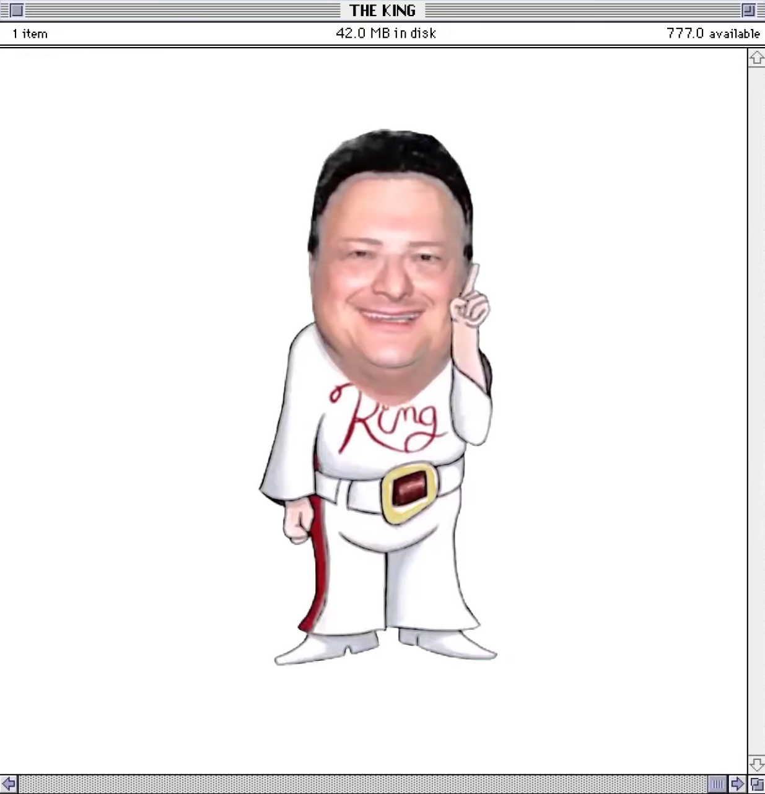

# 🦖 Nedry SDDM Login Fail

> *"You didn't say the magic word!"*



Plays the Jurassic Park Nedry clip — video fullscreen + audio — whenever someone enters a wrong password at the SDDM login screen.

## Requirements

- Fedora with KDE Plasma 6 (or any distro running Plasma 6 + PipeWire)
- SDDM login manager
- A compatible KDE SDDM theme (see below)
- `alsa-utils` package (`sudo dnf install alsa-utils`)

## Compatible Themes

The installer scans all installed SDDM themes and lists only compatible ones. A theme is compatible if it:

- Has an `onLoginFailed` handler
- Does **not** use the deprecated `org.kde.plasma.core 2.0` module (Plasma 5 only)

The installer handles three `onLoginFailed` styles automatically:
- Signal handler: `onLoginFailed: { ... }`
- Function: `function onLoginFailed() { ... }`
- Single-line: `onLoginFailed: notificationMessage = "..."` (expanded automatically)

Root block types supported: `Item`, `Rectangle`, `FocusScope`, `Control`, and others.

Confirmed working:
- `breeze` ✅
- `Noir-SDDM-6` ✅
- Most KDE Plasma 6 community themes ✅

Incompatible:
- Themes using `org.kde.plasma.core 2.0` (Plasma 5 era) ❌

## Package Contents

```
nedry-sddm/
├── install.sh       ← Run this first
├── uninstall.sh     ← Restores your theme to its original state
├── configure.sh     ← Change audio device after install
├── fail_h264.mp4    ← The Nedry video clip (H.264)
├── fail.wav         ← Audio extracted from the clip
└── README.md
```

## Installation

```bash
cd nedry-sddm/
sudo ./install.sh
```

The installer will:
1. List only compatible SDDM themes and let you pick one
2. Back up the original `Main.qml` as `Main.qml.bak`
3. Surgically patch the theme's `Main.qml` — preserving all its original structure
4. Inject `import org.kde.plasma.plasma5support` if the theme doesn't already have it
5. Copy the video and audio files into the theme directory
6. List your available audio output devices and let you pick one
7. Play a test sound to confirm it works
8. Save a `nedry.conf` config file to the theme directory

**To test:** fully log out (don't lock), then enter a wrong password.

## Uninstall

```bash
sudo ./uninstall.sh
```

Restores the original `Main.qml` from the backup and removes all Nedry files. If you installed into multiple themes it will ask which one(s) to restore.

## Changing Audio Device Later

If you swap headsets, plug in new speakers, or add/remove USB audio devices:

```bash
sudo ./configure.sh
```

Re-lists your devices by stable name, lets you pick, tests the audio, and updates everything automatically. Device names are stored as `sysdefault:CARD=Name` rather than `hw:0,0` style numbers, so they survive reboots and USB changes without needing reconfiguration.

## How It Works

- Video plays via Qt6 `QtMultimedia` (`MediaPlayer` + `VideoOutput`)
- Audio plays separately via `PlasmaCore.DataSource` executable engine calling `aplay`
- This bypasses QtMultimedia's broken audio path in SDDM's restricted pre-login environment
- Both fire simultaneously on the `onLoginFailed` signal
- A spam guard (`playingFail` flag) prevents the clip retriggering if the wrong password is entered repeatedly while it's playing
- A 10-second safety timer force-stops the video if `MediaPlayer` stalls

## Audio Device Notes

The installer uses `aplay -L` to list devices by stable card name (e.g. `sysdefault:CARD=Generic_1`) rather than numeric index (e.g. `hw:2,0`). This means audio keeps working even if USB devices are added or removed and ALSA renumbers the cards.

On Fedora (PipeWire), your devices will appear as `sysdefault:CARD=<name>`. Common examples:
- `sysdefault:CARD=Generic_1` — motherboard analog output (3.5mm jack)
- `sysdefault:CARD=HyperSense` — USB headset
- `hdmi:CARD=NVidia,DEV=0` — HDMI audio output

## Troubleshooting

**No audio:** Run `sudo ./configure.sh` and pick a different device. If the test sound passes in configure but not at login, try `sysdefault:CARD=<yourcard>` instead of an `hdmi:` device — HDMI audio may not be active at the login screen.

**No video:** Check that `fail_h264.mp4` is in the theme directory (`/usr/share/sddm/themes/<theme>/`) and is valid H.264. Run the QML test below to see errors.

**QML errors / black screen on logout:** Clear the SDDM cache manually and test:
```bash
sudo rm -rf /var/cache/sddm/* /root/.cache/sddm* /var/lib/sddm/.cache
sddm-greeter-qt6 --test-mode --theme /usr/share/sddm/themes/<yourtheme>
```

**Theme not listed by installer:** The theme either uses `org.kde.plasma.core 2.0` (Plasma 5, not supported) or has no `onLoginFailed` handler. Check the theme's `Main.qml` manually.

**Broke my theme:** Run `sudo ./uninstall.sh` to restore the original, then reinstall.
